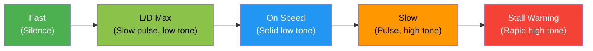

# How AOA Tones Work

OnSpeed maps your angle of attack to a **continuous spectrum of audio cues**. As you slow down (AOA increases), the tones progress through distinct regions — from silence through stall warning.

## The Tone Map

### Region by Region

As AOA increases (you slow down or load up), you hear:

#### 1. Silence — Below L/D Max AOA

You're well above best-glide speed. No tones play. This is normal for cruise, downwind, and most maneuvering.

#### 2. Slow Pulse, Low Tone — L/D Max to On-Speed-Fast

A low-pitched tone pulses slowly (about 1.5 pulses/sec), speeding up as you approach the on-speed band (up to ~8 pulses/sec). This region spans from best-glide speed (L/D max) down to your target approach speed.

Think of this as: *"You're getting into the approach speed range."*

#### 3. Solid Low Tone — On-Speed-Fast to On-Speed-Slow

The pulse stops and you hear a **steady, solid low-pitched tone**. This is your target zone for approach and landing. Fly to keep this tone steady.

Think of this as: *"You're on speed. This is where you want to be."*

#### 4. Pulse, High Tone — On-Speed-Slow to Stall Warning

The tone jumps to a **higher pitch** and starts pulsing again — slowly at first (~1.5 pulses/sec), speeding up as you get slower (up to ~6 pulses/sec). This is your "getting slow" warning.

Think of this as: *"You're below target speed. Add power or lower the nose."*

#### 5. Stall Warning — Above Stall Warning AOA

A **rapid high-pitched pulsing** at 20 pulses per second — essentially a continuous buzz. This means stall is imminent.

Think of this as: *"Stall NOW. Reduce AOA immediately."*

!!! danger "Never ignore the stall warning"
    The stall warning tone overrides audio muting. Even if you've pressed the mute button, the stall warning will still sound if you're above the stall warning AOA and above the minimum IAS threshold.

## Tone Characteristics

| Region | Tone Pitch | Pulse Rate | AOA Range |
|--------|-----------|------------|-----------|
| Fast (silence) | — | — | Below L/D Max |
| Approaching | Low | 1.5 – 8.2 pps | L/D Max → On-Speed-Fast |
| On Speed | Low | Solid (no pulse) | On-Speed-Fast → On-Speed-Slow |
| Getting Slow | High | 1.5 – 6.2 pps | On-Speed-Slow → Stall Warn |
| Stall Warning | High | 20 pps | Above Stall Warn |

Within the pulsing regions, the pulse rate is **interpolated linearly** — so you get a smooth, continuous indication of where you are. Faster pulses = closer to the next boundary.

## Muted Mode

If you press the audio mute button:

- All normal tones are silenced
- The **stall warning still sounds** (for safety)
- Stall warning in muted mode requires both AOA above the stall threshold AND IAS above the mute-under-IAS setting

## 3D Audio (Optional)

When enabled, OnSpeed uses the IMU's lateral acceleration to **pan the tones left and right** in your headset. If you're in uncoordinated flight (slipping or skidding), the tone shifts to one ear. This gives you subconscious slip/skid awareness — useful for maintaining coordination in the pattern.

3D audio requires stereo wiring to your headset (see [Audio Wiring](../installation/audio.md)).

## Why This Works

The beauty of AOA-based tones is that you don't have to learn speeds for different configurations. The system is calibrated so that:

- **On-speed tone** = correct approach speed for your current flap setting and weight
- **Stall warning** = same margin from stall regardless of bank angle or G-load
- You get the **same audio cue** whether you're straight-and-level at 1G or in a 60-degree bank at 2G

Your ears learn the tone progression after a few flights. After that, you have subconscious energy awareness — you'll know you're getting slow before you consciously think about it.
