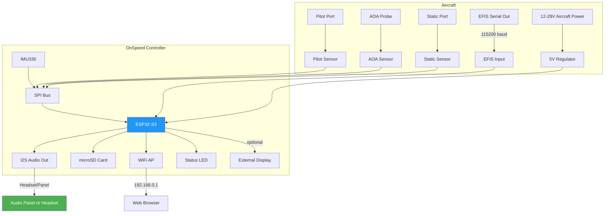

# System Overview

The OnSpeed Gen3 is a self-contained AOA computer built around an ESP32-S3 microcontroller. Here's what's inside and how the pieces fit together.

## What's in the Box

The Gen3 controller board includes:

| Component | Part | Function |
|-----------|------|----------|
| **Microcontroller** | ESP32-S3-WROOM-2 (32MB flash, 8MB PSRAM) | Runs everything — AHRS, audio, WiFi, logging |
| **IMU** | IMU330 (accel + gyro) | Measures pitch, roll, and accelerations at 208 Hz |
| **Pitot Pressure** | Honeywell HSCDRNN1.6BASA3 | Dynamic pressure for airspeed (14-bit SPI) |
| **AOA Pressure** | Honeywell HSCDRNN1.6BASA3 | Differential pressure from AOA probe (14-bit SPI) |
| **Static Pressure** | Honeywell HSCDRRN100MDSA3 | Barometric pressure for altitude/density |
| **Audio DAC** | I2S output | Stereo audio at 16 kHz sample rate |
| **SD Card** | microSD slot | Flight data logging at 50 Hz |
| **WiFi** | Built into ESP32-S3 | Web-based configuration and log download |
| **External ADC** | MCP3202 (12-bit, V4P hardware) | Reads flap position potentiometer and volume knob |
| **Voltage Regulator** | L7805ABD2T-TR | Accepts 12–28V aircraft power, provides 5V |

## System Block Diagram

## Data Flow

Every 20 milliseconds (50 Hz), the system:

1. **Reads pressure sensors** — pitot, AOA, and static pressures via SPI
2. **Reads the IMU** — accelerometer and gyroscope at 208 Hz (4× per pressure sample)
3. **Runs the AHRS algorithm** — Madgwick or EKF6 fuses IMU data into pitch/roll/heading
4. **Computes Derived AOA** — `SmoothedPitch - FlightPath` (where FlightPath = arcsin(VSI / TAS))
5. **Calculates IAS** — from pitot dynamic pressure
6. **Reads EFIS data** — if connected, gets IAS, pitch, OAT, altitude from your glass panel
7. **Detects flap position** — from potentiometer or jumper settings
8. **Selects tone** — maps AOA against the current flap setting's thresholds
9. **Generates audio** — I2S stereo output with optional 3D panning
10. **Logs to SD card** — all sensor data, computed values, and state

## Connections to Your Aircraft

The controller needs the following connections:

### Required

- **12–28V power** — from aircraft bus through a circuit breaker
- **Pitot line** — connects to your pitot system (tee fitting)
- **AOA line** — connects to your AOA pressure probe
- **Static line** — connects to your static system (tee fitting)
- **Audio output** — to audio panel or headset (see [Audio Wiring](../installation/audio.md))

### Recommended

- **EFIS serial** — from your Dynon, Garmin, or MGL for IAS, OAT, and attitude data
- **Flap position** — potentiometer or jumper wires for flap detection

### Optional

- **OAT sensor** (DS18B20) — if you don't have an EFIS providing outside air temperature
- **AOA indexer** — NeoPixel LED strip for visual AOA indication
- **External display** — M5Stack or similar for cockpit display
- **Boom probe** — reference AOA probe for testing/calibration

## Software Architecture

The firmware runs as a set of **FreeRTOS tasks** on the ESP32-S3's dual cores:

| Core | Tasks | Priority |
|------|-------|----------|
| **Core 1** (flight-critical) | Sensors, IMU, Audio, Display Serial, Flaps, G-limit, Volume, Vno Chime, 3D Audio | High |
| **Core 0** (connectivity) | WiFi, Web Server, WebSocket Data Server, Log Writer, Heartbeat LED | Lower |

This separation ensures that sensor reading and audio generation are never blocked by WiFi traffic or web page serving.

## AHRS Algorithms

OnSpeed supports two attitude estimation algorithms, selectable in configuration:

- **Madgwick** (default) — Complementary filter using quaternion math. Well-proven, lower CPU cost.
- **EKF6** — 6-state Extended Kalman Filter estimating pitch, roll, AOA, and 3 gyro biases. More sophisticated, better long-term stability.

!!! warning "Switching algorithms requires recalibration"
    The calibration wizard fits AOA curves against Derived AOA, which differs between Madgwick and EKF6. If you change your AHRS algorithm, you must re-fly the calibration wizard.
